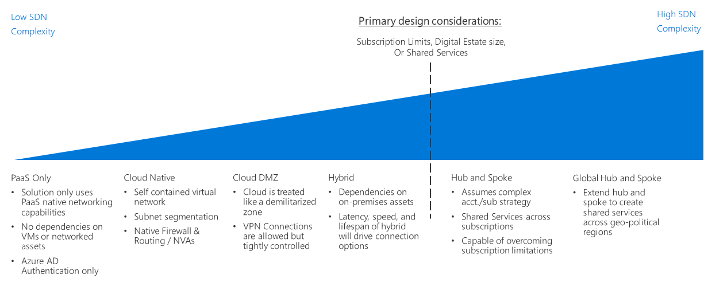

# Fusion: Which Software Defined Network is best for my deployment?

Software Defined Networking (SDN) is a network architecture designed to allow virtualized networking functionality that can be centrally managed, configured, and modified through software. SDN provides an abstraction layer over the physical networking infrastructure, and enables the virtualized equivalent to physical routers, firewalls, and other networking hardware you would find in an on-premises network.

SDN allows IT staff to configure and deploy network structures and capabilities that support workload needs using virtualized resources. The flexibility of software-based deployment management enables rapid modification of networking resources and allows the ability to support both agile and traditional deployment models. Virtualized networks created with SDN technology are critical to creating secure networks on a public cloud platform.

## Networking decision guide

Jump to: [PaaS Only](paas-only.md) | [Cloud native](cloud-native.md) | [Hybrid](hybrid.md) | [Hub/Spoke model](hub-spoke.md) | [Discovery questions](#choosing-the-right-virtual-networking-architectures)

SDN provides several options with varying degrees of pricing and complexity. The above discovery guide provides a reference to quickly personalize these options to best align with specific business and technology strategies.

The inflection point in this guide depends on several key decisions that your Cloud Strategy team have made prior to making decisions about networking architecture. Most important among these are decisions involving your [Digital Estate definition](../../digital-estate/overview.md) and [Subscription Design](../subscriptions/overview.md) (which may also require inputs from decisions made related to your cloud accounting and global markets strategies).

Small, single region deployments of less than 1,000 VMs are less likely to be significantly impacted by this inflection point. Conversely, large adoption efforts with more than 1,000 VMs, multiple business units, or multiple geo-politic markets, could be substantially impacted by your SDN decision and this key inflection point.

## Choosing the right virtual networking architectures

This section expands on the decision guide to help you choose the right virtual networking architectures.

There are numerous ways to implement SDN technologies to create cloud-based virtual networks. How you structure the virtual networks used in your migration and how those networks interact with your existing IT infrastructure will depend on a combination of the workload requirements and your governance requirements.

When planning which virtual networking architecture or combination of architectures to consider when planning your cloud migration, consider the following questions to help determine what's right for your organization:

| Question | PaaS Only | Cloud Native | Cloud DMZ | Hybrid | Hub and Spoke |
|-----|-----|-----|-----|-----|-----|
| Will your workload only use PaaS services and not require networking capabilities beyond those provided by the services themselves? | Yes | No | No | No | No |
| Does your workload require integration with on-premises applications? | No | No | Yes | Yes | Yes |
| Have you established mature security policies and secure connectivity between your on-premises and cloud networks? | No | No | No | Yes | Yes |
| Does your workload require authentication services not supported through cloud identity services, or do you need direct access to on-premises domain controllers? | No | No | No | Yes | Yes |
| Will you need to deploy and manage a large number of VMs and workloads? | No | No | No | No | Yes |
| Will you need to provide centralized management and on-premises connectivity while delegating control over resources to individual workload teams? | No | No | No | No | Yes |

## Virtual networking architectures

Learn more about the primary software defined networking architectures:

- [**PaaS Only**](paas-only.md): Platform as a Service (PaaS) products support a limited set of built-in networking features and may not require an explicitly defined software defined network to support workload requirements.
- [**Cloud Native**](cloud-native.md): A cloud native virtual network is the default software defined networking architecture when deploying resources to a cloud platform.
- [**Cloud DMZ**](cloud-dmz.md): Provides limited connectivity between your on-premises and cloud network which is secured through the implementation of a demilitarized zone on the cloud environment.
- [**Hybrid**](hybrid.md): The hybrid cloud network architecture allows virtual networks to access your on-premises resources and vice versa.
- [**Hub and Spoke**](hub-spoke.md): The hub and spoke architecture allows you to centrally manage external connectivity and shared services, isolate individual workloads, and overcome potential subscription limits.

## Learn more

See the following for more information about software defined networking in the Azure platform.

- [Azure Virtual Network](/azure/virtual-network/virtual-networks-overview). On Azure, the core SDN capability is provided by Azure Virtual Network, which acts as a cloud analog to physical on-premises networks. Virtual networks also act as a default isolation boundary between resources on the platform.
- [Azure Network Security Best Practices](/azure/security/azure-security-network-security-best-practices). Recommendations from the Azure Security team on how to configure your virtual networks to minimize security vulnerabilities.

## Next steps

Learn how logs, monitoring, and reporting are used by operations teams to manage the health and policy compliance of cloud workloads.

> [!div class="nextstepaction"]
> [Logs and Reporting](../logs-and-reporting/overview.md)
